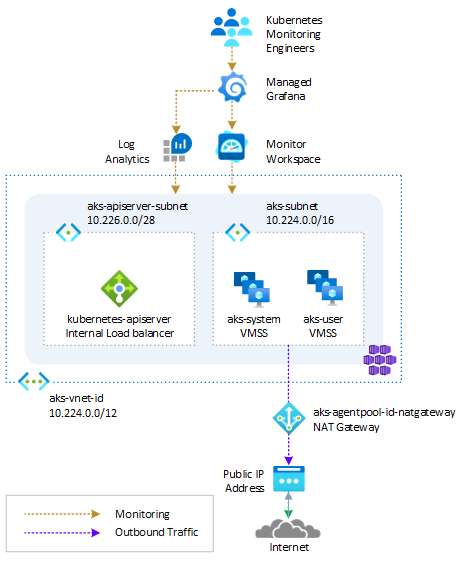

# Deploy and AKS Automatic cluster using Bicep

This project shows how to deploy an AKS automatic cluster configured with the following resources:

- [Azure Managed Prometheus](https://learn.microsoft.com/en-us/azure/azure-monitor/essentials/prometheus-metrics-overview) for metric collection.
- [Azure Managed Grafana](https://learn.microsoft.com/en-us/azure/managed-grafana/overview) for visualization
- [Container insights](https://learn.microsoft.com/en-us/azure/azure-monitor/containers/container-insights-overview) for log collection



## What is Azure Kubernetes Service (AKS) Automatic?

[Azure Kubernetes Service (AKS) Automatic](https://learn.microsoft.com/en-us/azure/aks/intro-aks-automatic) offers an experience that makes the most common tasks on Kubernetes fast and frictionless, while preserving the flexibility, extensibility, and consistency of Kubernetes. Azure takes care of your cluster setup, including node management, scaling, security, and preconfigured settings that follow AKS well-architected recommendations. Automatic clusters dynamically allocate compute resources based on your specific workload requirements and are tuned for running production applications.

- **Production ready by default:** Clusters are preconfigured for optimal production use, suitable for most applications. They offer fully managed node pools that automatically allocate and scale resources based on your workload needs. Pods are bin packed efficiently, to maximize resource utilization.

- **Built-in best practices and safeguards:** AKS Automatic clusters have a hardened default configuration, with many cluster, application, and networking security settings enabled by default. AKS automatically patches your nodes and cluster components while adhering to any planned maintenance schedules.

- **Code to Kubernetes in minutes:** Go from a container image to a deployed application that adheres to best practices patterns within minutes, with access to the comprehensive capabilities of the Kubernetes API and its rich ecosystem.

## Deployment

You can find Bicep module and Bash scripts to deploy the AKS Automatic cluster via [Bicep](https://learn.microsoft.com/en-us/azure/azure-resource-manager/bicep/overview?tabs=bicep) and the companion [AKS Store](https://github.com/Azure-Samples/aks-store-demo) application. You can use the bash script [01-deploy.sh](./bicep/01-deploy.sh) to register the required features flags. For more information, see [Quickstart: Deploy an Azure Kubernetes Service (AKS) Automatic cluster](https://learn.microsoft.com/en-us/azure/aks/learn/quick-kubernetes-automatic-deploy?pivots=bicep).

### Install the aks-preview Azure CLI extension

[!INCLUDE [preview features callout](../includes/preview/preview-callout.md)]

To install the aks-preview extension, run the following command:

```bash
az extension add --name aks-preview
```

Run the following command to update to the latest version of the extension released:

```bash
az extension update --name aks-preview
```

### Register the feature flags

To use AKS Automatic in preview, you must register feature flags for other required features. Register the following flags using the [az feature register](https://learn.microsoft.com/en-us/cli/azure/feature?view=azure-cli-latest#az-feature-register) command.

```bash
az feature register --namespace Microsoft.ContainerService --name EnableAPIServerVnetIntegrationPreview
az feature register --namespace Microsoft.ContainerService --name NRGLockdownPreview
az feature register --namespace Microsoft.ContainerService --name SafeguardsPreview
az feature register --namespace Microsoft.ContainerService --name NodeAutoProvisioningPreview
az feature register --namespace Microsoft.ContainerService --name DisableSSHPreview
az feature register --namespace Microsoft.ContainerService --name AutomaticSKUPreview
```

Verify the registration status by using the [az feature show](https://learn.microsoft.com/en-us/cli/azure/feature?view=azure-cli-latest#az-feature-show) command. It takes a few minutes for the status to show *Registered*:

```bash
az feature show --namespace Microsoft.ContainerService --name AutomaticSKUPreview
```

When the status reflects *Registered*, refresh the registration of the *Microsoft.ContainerService* resource provider by using the [az provider register](https://learn.microsoft.com/en-us/cli/azure/provider?view=azure-cli-latest#az-provider-register) command:

```bash
az provider register --namespace Microsoft.ContainerService
```
